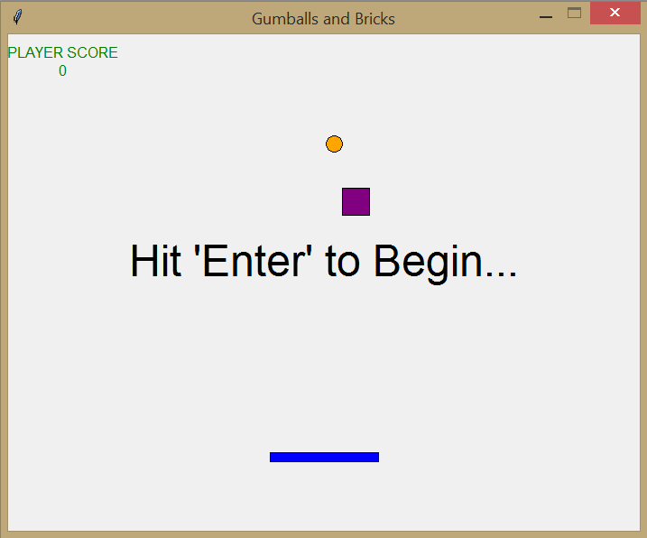
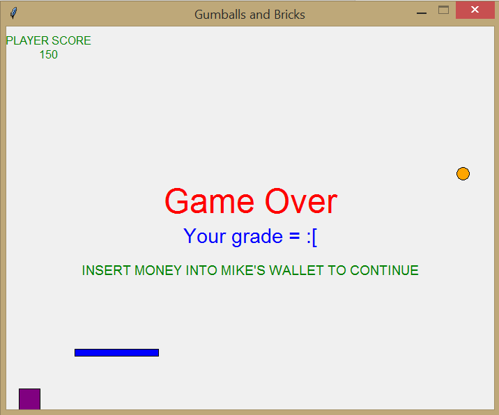

# Table Tennis - Solo
Table tennis game for 1 player. Use left and right to control paddle. The block and ball objects must not touch the base of the window. The ball can bounce off of the block. The player can use "english" by hitting the block or ball while traveling in the same direction.

 

 

## Getting Started
Install Python. Run as a module in the Python shell.

## Technology used
Python